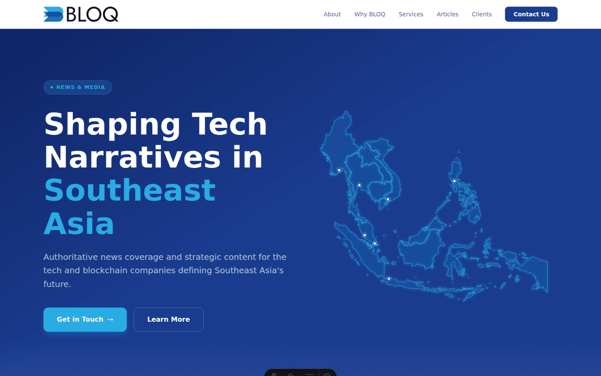

# BLOQ Media

The public marketing site for **BLOQ Media** — a news organization and content studio covering the tech and blockchain sector in Southeast Asia. Live at [www.bloq.media](https://www.bloq.media).



## What this is

A single-page site that explains what BLOQ Media does (informs, inspires, and engages audiences across Southeast Asia's tech scene), who it's for, and how to get in touch. It includes:

- An interactive map of the region's key markets (Singapore, Bangkok, Jakarta, Manila, Ho Chi Minh City, Kuala Lumpur, Yangon)
- Service and "why us" sections aimed at prospective clients/partners
- A client-logo strip
- A contact form that emails the team directly

## Status

Actively maintained and deployed to production on Vercel. Dependency updates are automated via Dependabot with CI-gated auto-merge for safe (patch/minor) bumps; majors are reviewed manually.

## Stack

- **[Astro v6](https://astro.build)** running in SSR mode (`output: 'server'`), deployed on **Vercel**
- **Tailwind CSS v4** via `@tailwindcss/vite` — brand tokens defined in `src/styles/global.css`
- **D3** to draw the hero section's Mercator map at build time (no map JavaScript ships to the browser)
- **[Satori](https://github.com/vercel/satori) + [resvg](https://github.com/RazrFalcon/resvg)** to generate the Open Graph share image at build time
- **Astro Fonts API** to self-host Inter with metric-matched fallbacks
- **Vitest** for the test suite; **[Web3Forms](https://web3forms.com)** to deliver contact-form submissions without running a mail server

## Architecture

The main page (`src/pages/index.astro`) is composed from section components (`Hero`, `About`, `WhyBloq`, `Services`, `Articles`, `Clients`, `ContactForm`, `Footer`). It, the `/privacy` and `/terms` pages, the custom 404 page, and two generated images are all prerendered at build time and served statically from Vercel's CDN:

| Route                            | Purpose                                                             |
| -------------------------------- | ------------------------------------------------------------------- |
| `/`, `/privacy`, `/terms`, `404` | Static HTML pages                                                   |
| `/og-image.png`                  | The 1200×630 social share image, rendered with satori at build time |
| `/hero-map.svg`                  | The hero section's map, drawn with D3 at build time                 |

Only one route stays server-rendered per request:

| Route               | Purpose                                                                                                       |
| ------------------- | ------------------------------------------------------------------------------------------------------------- |
| `POST /api/contact` | Validates form input, checks a honeypot field and a per-IP rate limit, then forwards the message to Web3Forms |

See [`CLAUDE.md`](CLAUDE.md) for a deeper architectural walkthrough (styling conventions, animation system, navbar behavior, etc.) — it's written for AI coding assistants but doubles as a solid internal dev doc.

## Running locally

```bash
npm install
cp .env.example .env   # then set PUBLIC_WEB3FORMS_KEY — see below
npm run dev             # http://localhost:4321
```

Other useful commands:

```bash
npm run build     # production build
npm run preview   # preview the production build locally
npm run check     # TypeScript / Astro type-check
npm test           # run the test suite once
npm run test:watch # watch mode
```

### Environment variables

| Variable               | Required                     | Notes                                                                                                                        |
| ---------------------- | ---------------------------- | ---------------------------------------------------------------------------------------------------------------------------- |
| `PUBLIC_WEB3FORMS_KEY` | For the contact form to work | Free access key from [web3forms.com](https://web3forms.com). Without it, `/api/contact` still serves but always returns 500. |

## License

All rights reserved. This repository is public so the code can be reviewed, but no license is granted to reuse, redistribute, or build on it — see [`LICENSE`](LICENSE).
